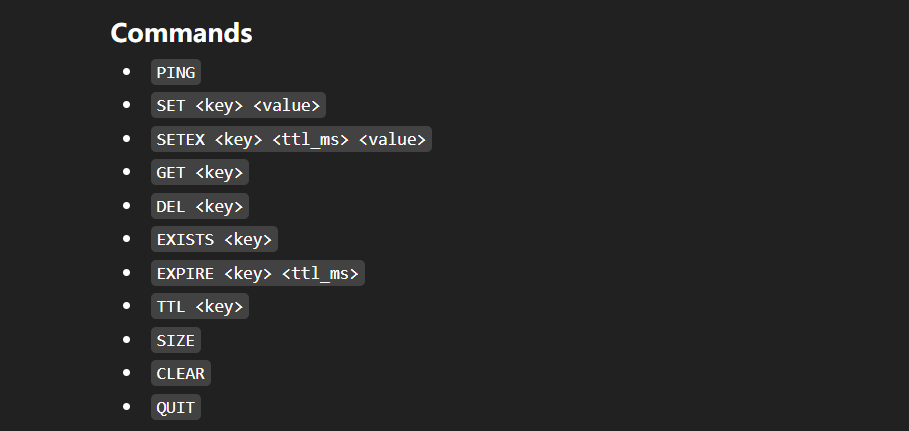

# lightkv

A lightweight in-memory key-value storage system written in C++17.

## Features

- in-memory key-value storage
- sharded thread-safe storage
- TTL expiration with lazy deletion
- global LRU hot cache
- TCP server with text protocol
- thread pool
- unit tests
- benchmark
- architecture / roadmap docs

## Build

```bash
mkdir -p build
cd build
cmake ..
cmake --build . -j

